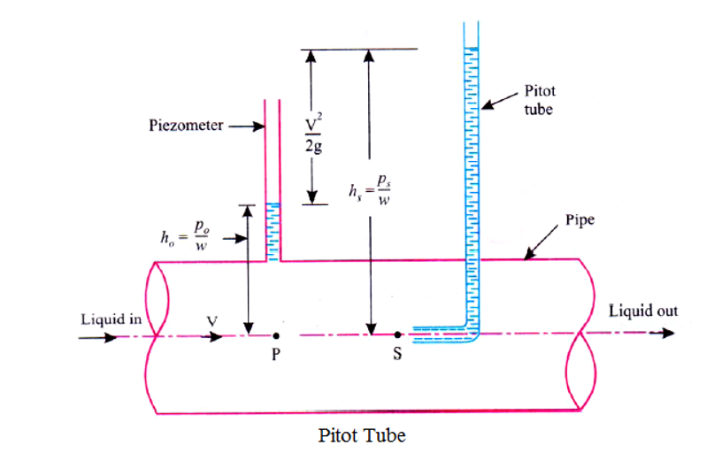

This folder has 

### Aim: 

To determine the local point pressure with the help of pitot tube.

### THEORY

It is a device used for measuring the velocity of flow at any point in a pipe. It is based on the principle that if the velocity of flow at a point becomes zero, there is increase in pressure due to the conversion of the kinetic energy into pressure energy. The pitot tube consists of a capillary tube, bend at right angle. The lower end is directed in the up stream direction. The liquid rises up in the tube due to conversion of kinetic energy into pressure energy. The velocity is determined by measuring the rise of liquid in the tube.

When a pitot tube is used for measuring the velocity of flow in a pipe, the pitot tube may be inserted in the pipe. Since a pitot tube measures the stagnation pressure heat at its dipped end. The pressure head may be determined directly by conducting a differential manometer between the pitot tube and pressure taping at the pipe surface.
 

## Applications of this experiment are:

•	A ship or a boat can float on water because the weight of the displaced water is equal to the weight of the ship or boat.
•	A submarine can dive into the water or can float on it. A submarine consists of ballast tanks that are filled with air or water. The tanks weigh less than an equal volume of water and make the sub float on the surface. If the tanks are partly filled with air, it is possible to make the submarine float at some depth of the water without either rising or sinking.
•	Hot air balloons rise into the air because the density of the warmer air inside the balloon is less dense than the colder air outside. The basic principle of hot air balloon is the use of hot air to create buoyancy, which generates lift.
•	Water striders can float on the water since its legs expel water, and the weight of the expelled water is equal to the floating force.

### DESCRIPTION

The apparatus consists of sump tank with centrifugal pump. A pitot tube made of copper provided in the test section made of acrylic connected to pipeline with flow control valve. The pointer gauge is provided to measure the vertical position of pitot tube in test section. A manometer is provided to determine the pressure difference. Discharge is measured with the help of measuring tank and stop watch.

### PROCEDURE

1.	Close all the valves.
2.	Fill sump tank ¾ with clean water and ensure that no foreign particles are there. 
3.	Open by-pass valve.
4.	Ensure that ON/OFF switch given on the panel is at OFF position.
5.	Switch on the main power supply and then switch ON the pump.
6.	Open flow control valve and allow water to flow through test section by partially closing valve.
7.	Open the air release valve provided on the manometer, slowly to release the air from manometer.
8.	When there is no air in the manometer, close air release valve.
9.	Set the position of pitot tube at the centre of the test section by adjusting the pointer to zero by knob provided.
10.	Adjust water flow rate with the help of control valve and by pass valve.
11.	Record the manometer reading.
12.	Measure the flow of water, discharged, using stop watch and measuring tank.
13.	Repeat the experiment for different flow rates of water by operating control valve and by-pass valve.
14.	Record the manometer reading for different position of pitot tube at particular discharge for determination of velocity profile.

### RESULTS

Coefficient of discharge of pitot tube, Cv  =

### PRECAUTIONS

1.	1.	Never run the apparatus if power supply is less than 180 volts and above 230 volts.
2.	Always use clean water.
3.	To prevent clogging of moving parts, run pump at least once in a fortnight.
4.	Drain the apparatus completely after experimentation.
5.	Always keep apparatus free from dust.

