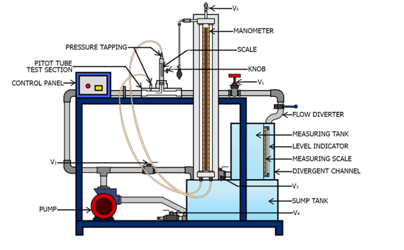

<b>Requirements (Instruments, Chemicals & Other) : </b>  
The apparatus consists of sump tank with centrifugal pump. A pitot tube made of copper provided in the test section made of acrylic connected to pipeline with flow control valve. The pointer gauge is provided to measure the vertical position of pitot tube in the given test section. A manometer is provided to determine the pressure difference. we need to calculate the discharge using the measuring tank and a stopwatch. The flow of water is regulated with the help of Control and by pass valve.  

  

The following precautions have to be followed: 

•	Check electric supply matches with the requirement of the experimental setup.  
•	While performing experiment always maintain the water in overhead tank. 
•	After experiment is complete drain the apparatus and Switch Off the power supply. 
•	Avoid parallax error while noting down the reading from tubes.  

<b>Procedure : </b> 
1.	Ensure that the power panel is at OFF position and all the drain valves are closed. 
2.	Fill ¾ of sump tank with clean water and open the by-pass valve V2. 
3.	Switch on the power supply to the experimental setup and the centrifugal pump. 
4.	Open valve V1 and allow water to flow through test section by partially closing valve V2. 
5.	The air release valve V5 present on the manometer should be slowly opened to release the air from it. This valve shall be closed when no more air is present in the manometer. 
6.	Using the knob provided with the pitot tube, position it at the centre of the test section by adjusting its pointer to zero. 
7.	The water flow rate shall be adjusted using the control valve V1 and the bypass valve V2. 
8.	Record the manometer reading.  
9.	Measure the discharge using measuring tank and the stop watch. 
10.	Using the knob, change the position of the pitot tube and record the manometer reading for the discharge (calculated in step 9). Repeat this for different positions of the pitot tube in order to obtain the velocity profile. 
11.	Now, vary the flow rate through the use of control valve V1 and the bypass valve V2 and repeat step 7 to 10. 
12.	Turn OFF the pump and power supply. 
13.	Drain the apparatus using valve V3 and V4.  

