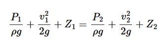
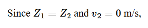
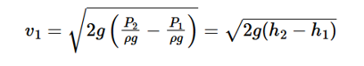
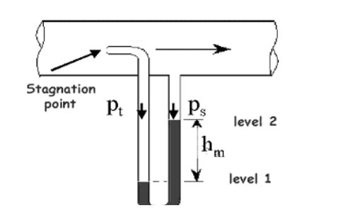

Pitot tube is a flow-measuring device which is used to measure the flow velocity at any chosen point in the flow-field. It works on the principle that if the flow velocity at any point is brought to rest, there will be an increase in pressure at the point because of the conversion of kinetic energy into pressure energy. The pitot tube is a capillary tube bent at right angle. The lower end of the tube is placed in flow such that it faces the upstream direction and the fluid rises in the tube because of change in kinetic energy into pressure energy. By measuring the height of the fluid which has risen in the tube, one can calculate flow velocity. Pitot static tube is one of the applications of Bernoulli’s Theorem which is valid in regions of steady, incompressible flow where net frictional forces are negligible. With the help of Pitot static tube, we can find the actual velocity at different points of a cross-section. However, mean velocity will be same across the cross-section. Since a Pitot tube measures the stagnation pressure head (or the total head) at its dipped end. The pressure head may be determined directly by connecting a differential manometer between the Pitot tube and pressure taping at the pipe surface. The pitot tube can measure the stagnation pressure head (or total head) using a differential manometer connected between the open end of the pitot tube and the pressure taping which is present at the pipe surface. Consider two points 1 and 2 at the same level in such a way that point 1 is at the inlet of the pitot tube and point 2 is at the outlet. At point 1 the pressure is P1 and the velocity of the stream is v1. However, at point 2 the fluid is brought to rest and the energy has been converted to pressure energy. Therefore the pressure at 2 is P2, the velocity v2 is zero and since 1 and 2 are in the same horizontal plane, Applying Bernoulli’s equation at points (1) and (2)...  

  
  
  

    

